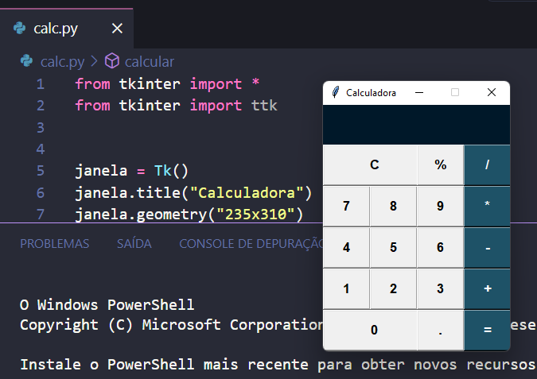

# calculadora python 
  

## Função:
* Programa desenvolvido em Python para realização de cálculos básicos.

## Ferramentas e tecnologias usadas:
1. Python 
2. Visual Studio Code

 
 

## Uso do vídeo 
 
<video src="./gravacao.mp4" controls="controls"> Uso do programa</video>
